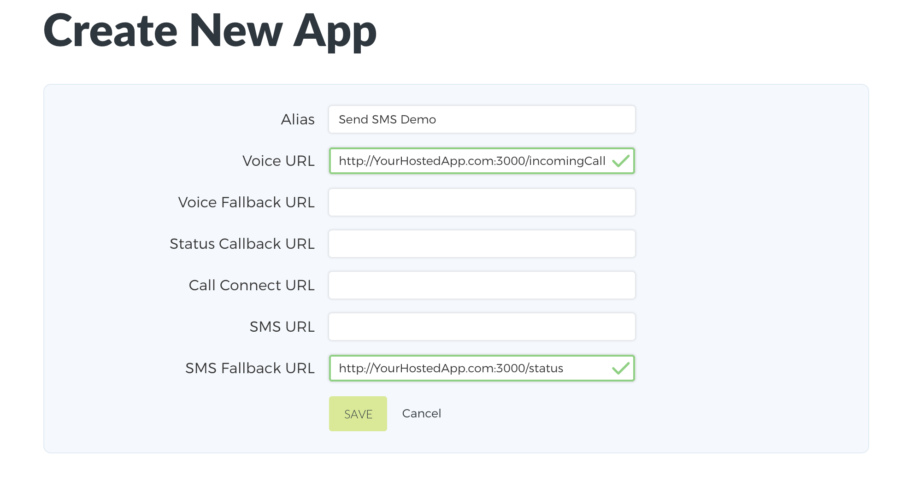
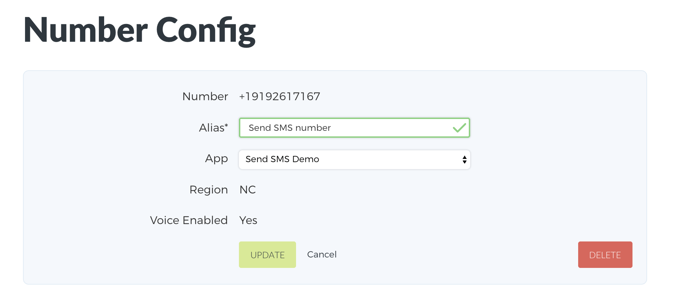

# Send SMS App

This project serves as a guide to help you build an application with Persephony. Specifically, the project will:

- Receive an incoming call
- Get digits (phone number) from the caller 
- Send an SMS to the phone number the caller input

## Setting up your new app within your Persephony account

1. After logging into your Persephony account, we will [Get a Persephony Phone Number](https://www.persephony.com/dashboard/portal/numbers/buy). Users will be calling this number to access your app.
2. Next, create a new app using the [Create New App form] setting the alias to `Send SMS Demo`(https://www.persephony.com/dashboard/portal/applications/new).

   When a phone call arrives to your Persephony phone number, Persephony will issue an HTTP Request to your application at a given url.

   This tutorial will use the `Voice URL` (with endpoint `/incomingCall`) and `Status Callback URL` (with endpoint `/status`).
   

3. Next, link your Persephony number to your Persephony app. Go to the [My Numbers page](https://www.persephony.com/dashboard/portal/numbers) and click on the number you purchased in Step 1. Set the app to your new Send SMS App.
   

## Setting up the Send SMS App locally

1. Download and install [Node.js](https://nodejs.org)
2. Install yarn globally [Mac OS](https://yarnpkg.com/lang/en/docs/install/#mac-stable) | [Windows](https://yarnpkg.com/lang/en/docs/install/#windows-stable)
3. Clone or download this repo
4. Install packages
  ```bash
    $ yarn install
  ```
5. Configure environment variables (this tutorial uses the [dotenv package](https://www.npmjs.com/package/dotenv))

   | ENV VARIABLE | DESCRIPTION |
   | ------------ | ----------- |
   | ACCOUNT_ID | Account ID which can be found under [API Keys](https://www.persephony.com/dashboard/portal/account/authentication) in Dashboard |
   | AUTH_TOKEN | Authentication Token which can be found under [API Keys](https://www.persephony.com/dashboard/portal/account/authentication) in Dashboard |
   | HOST_URL | URL for hosted Send SMS Application |

## Using the Send SMS Application

1. Run the application using command:

   ```bash
   $ node index.js
   Running the application on port 3000.
   ```

2. Call your Persephony number and follow the prompts!